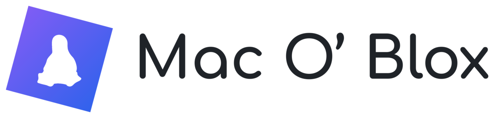

<p align="center">
  <picture>
    <source media="(prefers-color-scheme: dark)" srcset="branding/wordmark-dark.png">
    
  </picture>
</p>

<p align="center">
  The real macOS Roblox client, running on Linux through <a href="https://www.darlinghq.org">Darling</a>.
  improved by aubree.wtf with patches and more, originally created by narizy, credits to them.
</p>

<p align="center">
  <a href="https://discord.gg/jCjHYYNq48"></a>
</p>

<br>

Full graphics with antialiasing, sound, camera and mouse lock, a session that
survives restarts, and a small launcher with fast flags. Roblox Studio too, in
its Windows version through Wine. English and Russian.

## Install

```bash
curl -fsSL https://raw.githubusercontent.com/aubree-lat/MacOBlox/main/install.sh | bash
```

The installer welcomes you and explains the packages, destination and setup
steps before you begin. It prepares Darling and adds **Mac O’ Blox** to the
app menu. Open it for a first-time guide that downloads Roblox, prepares its
app environment, and explains how to sign in. Existing Roblox installations
open the launcher directly; **Setup guide** in its menu reopens the guide.

Run the same command again to update or uninstall. Updates save local source
changes in `~/.local/share/MacOBlox-backups` (or your XDG data directory) and
keep settings and sign-in. Without a terminal, or for scripts, the choices
are options too:

```bash
curl -fsSL https://raw.githubusercontent.com/aubree-lat/MacOBlox/main/install.sh | bash -s -- --uninstall
```

Installer and launcher updates exclude `website/` and its hosting configuration.

Uninstalling keeps Darling and its prefix, `~/.darling`, which holds your Roblox
sign-in; `--purge` (or **Uninstall everything** in the menu) deletes that too.

Works on Arch and its relatives (CachyOS, EndeavourOS, Manjaro), Ubuntu 24.04+,
Debian 13, Linux Mint 22 and Fedora with Darling built from source.

<details>
<summary>Install by hand</summary>

**1. Darling and the tools**

Arch, CachyOS, EndeavourOS, Manjaro:

```bash
paru -S darling-bin
sudo pacman -S clang lld unzip pipewire-audio python-gobject gtk4 libadwaita webkitgtk-6.0
```

Debian, Ubuntu, Mint: download `debs_20260608.zip` from the
[Darling release v0.1.20260608](https://github.com/darlinghq/darling/releases/tag/v0.1.20260608)
(the one Mac O’ Blox is tested with), then:

```bash
unzip debs_*.zip -d darling-debs
sudo apt install ./darling-debs/*/*.deb
sudo apt install clang lld unzip pipewire-bin python3-gi gir1.2-gtk-4.0 gir1.2-adw-1 gir1.2-webkit-6.0
```

Fedora and others: build Darling with the
[official guide](https://docs.darlinghq.org/build-instructions.html), then:

```bash
sudo dnf install clang lld unzip pipewire-utils python3-gobject gtk4 libadwaita webkitgtk6.0
```

**2. Mac O’ Blox**

```bash
git clone --filter=blob:none --no-checkout --depth 1 --single-branch --branch main \
  https://github.com/aubree-lat/MacOBlox ~/.local/share/MacOBlox
git -C ~/.local/share/MacOBlox sparse-checkout set --no-cone --stdin <<'PATTERNS'
/*
!/website/
!/.github/
!/vercel.json
!/.vercel/
!/.vercelignore
PATTERNS
git -C ~/.local/share/MacOBlox reset --hard HEAD
~/.local/share/MacOBlox/launcher/install.sh
```
</details>

## Questions

<details>
<summary>Is my account safe?</summary>

You sign in inside Roblox itself, the launcher never sees your password. The
session is stored only on your computer, in
`~/.darling/Users/$USER/Library/MacOBlox`. Do not share that folder, it works
like a password. **Sign out** in the settings deletes it.

Mac O’ Blox is not made by Roblox, using it is at your own risk.
</details>

<details>
<summary>Something does not work</summary>

When Roblox does not start, the launcher shows the error with a **Copy**
button. Send it to the [Discord](https://discord.gg/jCjHYYNq48). The last
error is also saved in `~/.cache/macoblox/last-error.txt`.
</details>

<details>
<summary>How do I sign in?</summary>

Signing up and signing in with a password show a captcha in a web page, which
Darling cannot display; Mac O’ Blox opens it in a window of its own instead
(it needs WebKitGTK 6.0, which the installer brings along). Without that
window, create the account on [roblox.com](https://www.roblox.com) first and
sign in in Mac O’ Blox with **Quick Login**: Roblox shows a code, enter it on a
phone or in a browser where you are already signed in.
</details>

<details>
<summary>Images or servers do not load</summary>

Some providers break Roblox's addresses. In **Settings → DNS for Roblox** pick
Quad9 or Cloudflare. Only Roblox uses it, the rest of the system keeps its DNS.
</details>

<details>
<summary>OpenGL and Vulkan rendering</summary>

**OpenGL** is the default and uses Roblox's own OpenGL renderer with the host
OpenGL driver. Mac O’ Blox hides the Metal device so Roblox selects this path.
Client startup was verified on NVIDIA OpenGL 4.1 using the client's GLSL shader
pack.

In **Settings → Environment → Game → Renderer**, choose **Vulkan (Zink,
experimental)** and restart Roblox. This uses [Mesa Zink](https://docs.mesa3d.org/drivers/zink.html)
to run the client's OpenGL renderer through Vulkan on Linux. It requires Mesa
EGL with Zink and a working hardware Vulkan driver. If Mesa EGL or Zink is
missing, source installations on Arch, Debian/Ubuntu and Fedora install the
required packages after you authorize an administrator prompt. The launcher
prefers **run0**; if unavailable, it uses **pkexec**, then **sudo** with a
graphical password helper, then **sudo** in an available terminal. Cancelling
authentication stops installation and keeps the previous renderer selected.
If no supported prompt is available, install the dependencies manually.
Flatpak graphics libraries come from its runtime; update that runtime if they
are missing.
The launcher checks hardware Vulkan support before starting; if that check
fails, select **OpenGL** again.

Vulkan gameplay is experimental. Client startup
and the MangoHud Vulkan overlay have been tested on an RTX 3060 Ti, with GL
tracing disabled. Heavy gameplay and other GPUs still need testing. This uses
the macOS client's OpenGL renderer; Metal and native client Vulkan are separate
backends.

With [MangoHud](https://github.com/flightlessmango/MangoHud) installed, enable
**Settings → Environment → Game → MangoHud overlay** and restart Roblox.
It works with both OpenGL and Vulkan (Zink) and is off by default. You can also
start the source launcher with `MANGOHUD=1 ./launcher/macoblox-launcher`.
The launcher also forwards `MANGOHUD_CONFIG` and `MANGOHUD_CONFIGFILE` to Roblox.
For the Flatpak, install the matching MangoHud extension with
`flatpak install flathub org.freedesktop.Platform.VulkanLayer.MangoHud//25.08`.
</details>

<details>
<summary>Roblox UI is too small on a high DPI monitor</summary>

Set **Settings → Environment → Game → Roblox UI scale** to **200%** for a
4K display, then restart Roblox. The control accepts 100–400% and keeps the
display's rendering resolution. Adjust it to suit your monitor.

For a manual settings edit, `"dpi_scale": 2.0` in
`~/.config/macoblox/settings.json` selects 200%. The `resolution` key is not
supported. If you previously added `DFFlagDisableDPIScale`, remove it from your
custom fast flags before testing scaling.
</details>

<details>
<summary>Native Wayland (experimental)</summary>

**Settings → Environment → Game → Window backend** defaults to **X11 / Xwayland**.
Native Wayland is available for experiments. Version 0.19 repairs separate EGL
view surfaces, window lookup and NVIDIA driver discovery, but full Roblox
presentation is still unfinished. Use X11 / Xwayland for normal gameplay.
</details>

<details>
<summary>Roblox Studio</summary>

Press **Roblox Studio** in the launcher. The first time it downloads Wine, DXVK
and Studio (about 800 MB) into its own folder, nothing is installed system-wide.
To sign in, Studio opens the Roblox login in your browser; when the browser asks
how to open the `roblox-studio-auth` link, choose **Roblox Studio (Mac O’ Blox)**.
</details>

<details>
<summary>Flatpak (testing)</summary>

The Flatpak brings Darling along and runs it without root (see
[flatpak/darling-noroot.c](flatpak/darling-noroot.c)), so nothing has to be
installed on the system. Download `MacOBlox-*.flatpak` from the
[latest release](https://github.com/aubree-lat/MacOBlox/releases/latest), then:

```bash
flatpak install --user MacOBlox-0.19-x86_64.flatpak
```

It keeps its own Darling prefix, so sign in to Roblox again there. Roblox Studio
is not in the Flatpak yet. To build it yourself:

```bash
flatpak install --user flathub org.flatpak.Builder org.gnome.Sdk//50 org.freedesktop.Sdk.Extension.llvm22//25.08
cd MacOBlox/flatpak
flatpak run --env=FLATPAK_USER_DIR=$HOME/.local/share/flatpak --command=flatpak-builder org.flatpak.Builder --user --install --force-clean build-dir wtf.aubree.MacOBlox.yml
```
</details>

<details>
<summary>How does it work?</summary>

Darling runs macOS programs on Linux. Roblox needs a few things Darling does not
have yet, so Mac O’ Blox adds a small library to the game: it connects the mouse,
sound, OpenGL and network to Linux and fixes bugs along the way. Details are in
[docs/NOTES.md](docs/NOTES.md).
</details>

## Credits

Made by [Narezany](https://github.com/narezy). This version is maintained by
[aubree.wtf](https://aubree.wtf), with stability and performance fixes.

[Darling](https://www.darlinghq.org) · Tux by Larry Ewing and The GIMP ·
[Comfortaa](https://github.com/alexeiva/comfortaa) font (SIL OFL) ·
[Archivo](https://github.com/Omnibus-Type/Archivo) and
[JetBrains Mono](https://github.com/JetBrains/JetBrainsMono) fonts in the launcher (SIL OFL) ·
icons from [Simple Icons](https://simpleicons.org)

Mac O’ Blox is MIT licensed. Not affiliated with Roblox Corporation.
